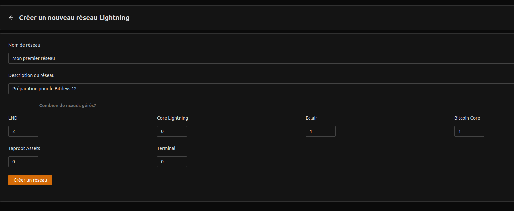
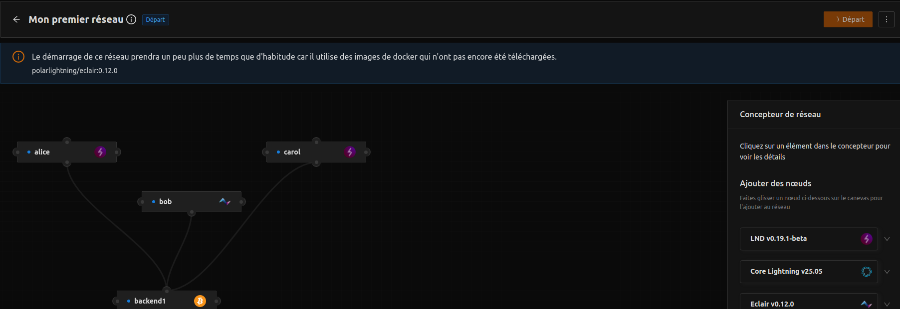

# Socratic Seminar #12 - Infrastructure Lightning avec Polar 

> Comprendre les différentes interactions entre les nœuds Lightning et comment la couche supérieure Lightning utilise la chaîne principale du protocole Bitcoin comme source de vérité.

## Information sur l'événement

- **Topic** [#6](https://github.com/BitDevsCotonou/Socratic-Seminar-Reports/issues/20) : Infrastructure Lightning avec Polar

- **Date** : 28.02.2026

- **Lieu** : [Maps](https://www.google.com/maps/place/SOROC/@6.3910649,2.3887839,17z/data=!3m1!4b1!4m6!3m5!1s0x10235525ea0a9f8d:0xfd88007f0ba23d15!8m2!3d6.3910649!4d2.3913588!16s%2Fg%2F11sh2b2g3c?entry=ttu&g_ep=EgoyMDI1MTAyMC4wIKXMDSoASAFQAw%3D%3D)

- **Inscription** : [Page Clooza](https://www.clooza.com/events/BITDEVS012)

## Facilitateurs principaux 

- [Olaniran](https://github.com/heyolaniran)

## A propos de la session 

Tout au long de cette session, nous pratiquerons les mécanismes sous-jacents de la couche Lightning et son interaction avec Bitcoin Core.

- Via une configuration simple entre deux nœuds, nous appliquerons le principe des canaux de paiements et le financement de canal de paiement.

- Scaler notre architecture pour comprendre comment les nœuds arrivent à interagir entre eux sans connexion directe 

- Comprendre comment les données circulent et comment l'intégrité des données est vérifiée sur l'ensemble de notre architecture.

## Ce qu'il faut avoir pour vraiment profiter

1. **Docker & Dépendances** 

Une installation Docker est nécessaire pour pouvoir avoir en local, une image de chaque type de nœud qui sera utilisée dans notre architecture.

> **Ressources utiles pour avoir Docker selon son système**

- [Docker Desktop sur Windows](https://docs.docker.com/desktop/setup/install/windows-install/) : téléchargez l'exécutable `.exe` selon la configuration de votre système.

- [Docker Desktop sur Ubuntu et dérivés](https://docs.docker.com/desktop/setup/install/linux/ubuntu/) : Docker Desktop sur Ubuntu et systèmes dérivés vous permet directement d'avoir les différentes dépendances supplémentaires utilisées par Polar.

- [Docker Desktop sur Debian](https://docs.docker.com/desktop/setup/install/linux/debian/)

- [Docker Desktop sur Fedora](https://docs.docker.com/desktop/setup/install/linux/fedora/)

- [Docker Desktop sur Arch](https://docs.docker.com/desktop/setup/install/linux/archlinux/) : Version expérimentale 

- [Docker Desktop sur macOS](https://docs.docker.com/desktop/setup/install/mac-install/)

2. **Polar**

[Polar](https://lightningpolar.com) est un logiciel qui se base sur des images d'implémentation de nœuds Lightning pour créer et configurer des architectures Bitcoin & Lightning en Regtest directement sur votre machine en utilisant des conteneurs Docker.

- [Polar sur Windows](https://github.com/jamaljsr/polar/releases/download/v4.0.0/polar-win-x64-v4.0.0.exe)

- [Polar sur macOS](https://github.com/jamaljsr/polar/releases/download/v4.0.0/polar-mac-arm64-v4.0.0.dmg)

- [Polar sur Linux](https://github.com/jamaljsr/polar/releases/download/v4.0.0/polar-linux-amd64-v4.0.0.deb)

3. **Avoir une configuration minimale** :

Pour cet atelier nous utiliserons des nœuds de l'implémentation LND (Lightning Network Daemon)qui est l'une des implémentations les plus populaires sur le protocole Lightning.

- Créez votre premier réseau sur Lightning

- Configurez votre réseau 

Ce réseau est constitué de : 

- 02 nœuds LND
- 01 nœud Eclair
- 01 nœud Bitcoin Core

`La configuration de votre réseau peut prendre plus ou moins de temps car en background Docker devra télécharger les images des différentes implémentations Bitcoin - Lightning.`

## Ressources utiles 

N'hésitez pas à laisser un message dans le [groupe de la communauté](https://chat.whatsapp.com/IfsmzGeleeUBwvy1AJ6W9U) si vous rencontrez un problème tout au long de votre pré-installation.

- [chainQuery](https://chainquery.com/bitcoin-cli) : Liste de commandes Bitcoin CLI

- [lncli](https://github.com/tomosaigon/lncli-commands) : Liste de commandes Lightning LND CLI

**Prêt à devenir un nœud Bitcoin ?** 🚀

[Retour à la liste des séminaires](../README.md)

